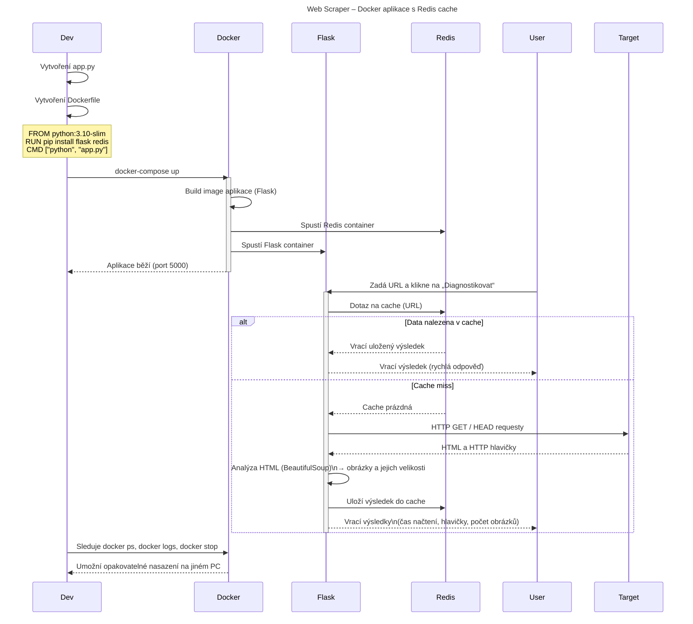

# Docker Web Scraper

Tento projekt ukazuje jednoduchou webovou aplikaci vytvořenou pomocí **Dockeru**, **Flasku** a **Redis**.  
Cílem projektu je demonstrovat, jak lze aplikaci zabalit do kontejnerů a spouštět ji konzistentně na různých počítačích bez ohledu na lokální prostředí (v rámci předmětu *Moderní algoritmy*).

## Struktura projektu
```text
docker-web-scraper/
├── app/
│   ├── app.py              
│   └── requirements.txt   
├── Dockerfile              
├── docker-compose.yml      
└── README.md
```

## Funkcionalita

- Flask aplikace běží v samostatném Docker kontejneru.
- Redis běží v samostatném kontejneru.
- Docker Compose zajišťuje spuštění a propojení obou služeb.
- Aplikace může ukládat a číst data z databáze Redis.

[Dokumentace projektu](moderni_alg_stetinova.pdf)


